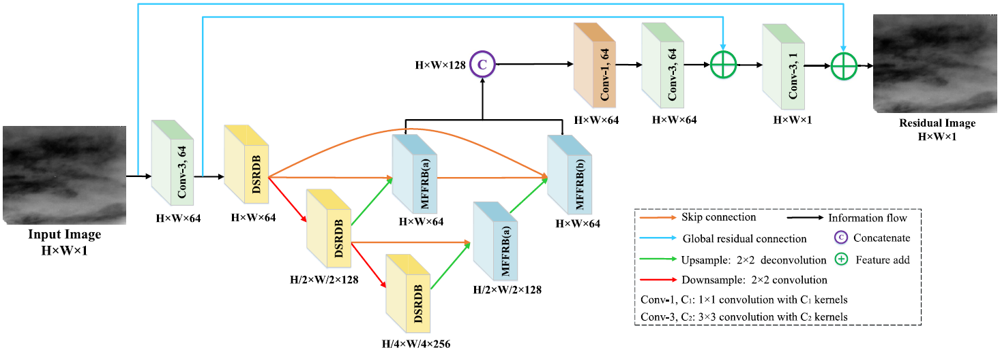
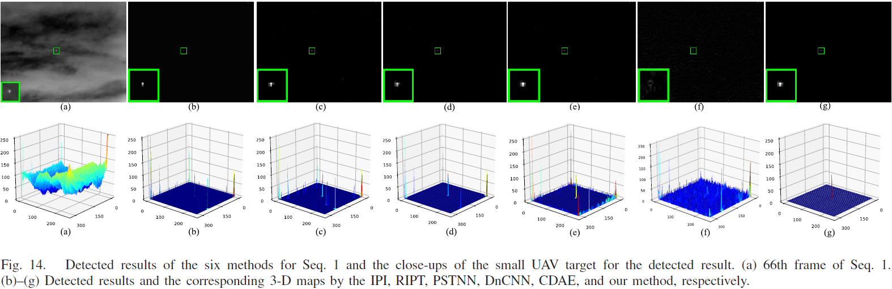

Official repository of our TGRS 2022 paper "Infrared Small UAV Target Detection Based on Depthwise Separable Residual Dense Network and Multiscale Feature Fusion".

## Infrared Small UAV Target Detection Based on Depthwise Separable Residual Dense Network and Multiscale Feature Fusion [[PDF](https://ieeexplore.ieee.org/abstract/document/9855493/)]

Houzhang Fang; Lan Ding; Liming Wang; Yi Chang; Luxin Yan; Jinhui Han

### Abstract

Unmanned aerial vehicles (UAVs) have been widely applied in military and civilian fields, but they also pose great threats to restricted areas, such as densely populated areas and airports. Thermal infrared (IR) imaging technology is capable of monitoring UAVs at a long range in both day and night conditions. Therefore, the anti-UAV technology based on thermal IR imaging has attracted growing attention. However, the images acquired by IR sensors often suffer from small and dim targets, as well as heavy background clutter and noise. Conventional detection methods usually have a high false alarm rate and low detection accuracy. This article proposes a detection method that formulates the UAV detection as predicting the residual image (i.e., background, clutter, and noise) by learning the nonlinear mapping from the input image to the residual image. The UAV target image is obtained by subtracting the residual image from the input IR image. The constructed end-to-end U-shaped network exploits the depthwise separable residual dense blocks in the encoder stage to extract the abundant hierarchical features. Besides, the multiscale feature fusion and representation block is introduced to fully aggregate multiscale features from the encoder layers and intermediate connection layers at the same scale, as well as the decoder layers at different scales, to better reconstruct the residual image in the decoder stage. In addition, the global residual connection is adopted in the proposed network to provide long-distance information compensation and promote gradient backpropagation, which further improves the performance in reconstructing the image. The experimental results show that the proposed method achieves favorable detection performance in real-world IR images and outperforms other state-of-the-art methods in terms of quantitative and qualitative evaluation metrics.

### DRUNet Framework



### Visualization

## Environment

Python>=3.5 and install torch and torchvision adapted with the current CUDA version.

### Installation

```
pip install -r requirements.txt
```

## How To Test

·The testing command is like

```shell
python test.py --weights-file 'weight/epoch_xx.pth' --test_data 'test'
```

The testing results will be saved in the ./results folder.

## How To Train

·The training command is like

```shell
python train.py --lr 1e-4 --epochs 300 --output-dir 'weight' --batch-size 4
```

Weight files will be stored in the ./weight folder.

## Citation
If you find our work useful in your research, please consider citing our paper using the following BibTeX entry:
```
@article{2022TGRS_DRUNet,
    title     = {{DRUNet}: Infrared Small UAV Target Detection Based on Depthwise Separable Residual Dense Network and Multiscale Feature Fusion},
    author    = {Houzhang Fang; Lan Ding; Liming Wang; Yi Chang; Luxin Yan; Jinhui Han},
    journal   = {IEEE Transactions on Geoscience and Remote Sensing},
    volume    = {71},
    year      = {2022},
    pages     = {1-20},
}
```

In additoin to the above paper, please also consider citing the following references. Thank you!
```
@inproceedings{2025CVPR_UniCD,
    title     = {Detection-Friendly Nonuniformity Correction: A Union Framework for Infrared {UAV} Target Detection},
    author    = {Houzhang Fang; Xiaolin Wang; Zengyang Li; Lu Wang; Qingshan Li; Yi Chang; Luxin Yan},
    booktitle = {IEEE/CVF Conference on Computer Vision and Pattern Recognition (CVPR)},
    year      = {2025},
    pages     = { },
}
@ARTICLE{2023TII_DAGNet,
    title     =  {Differentiated Attention Guided Network Over Hierarchical and Aggregated Features for Intelligent {UAV} Surveillance},
    author    =  {Houzhang Fang and Zikai Liao and Xuhua Wang and Yi Chang and Luxin Yan},
    journal   =  {IEEE Transactions on Industrial Informatics}, 
    year      =  {2023},
    volume    =  {19},
    number    =  {9},
    pages     =  {9909-9920},
}
@inproceedings{2023ACMMM_DANet,
    title       =  {{DANet}: Multi-scale {UAV} Target Detection with Dynamic Feature Perception and Scale-aware Knowledge Distillation},
    author      =  {Houzhang Fang and Zikai Liao and Lu Wang and Qingshan Li and Yi Chang and Luxin Yan and Xuhua Wang},
    booktitle   =  {Proceedings of the 31st ACM International Conference on Multimedia (ACMMM)},
    pages       =  {2121-2130},
    year        =  {2023},
}
@ARTICLE{2024TGRS_SCINet,
    title       = {{SCINet}: Spatial and Contrast Interactive Super-Resolution Assisted Infrared {UAV} Target Detection},
    author      = {Houzhang Fang; Lan Ding; Xiaolin Wang; Yi Chang; Luxin Yan; Li Liu; Jinrui Fang},
    journal     = {IEEE Transactions on Geoscience and Remote Sensing},
    volume      = {62},
    year        = {2024},
    pages       = {1-22},
}
```

## Contact
If you have any question, please contact: houzhangfang@xidian.edu.cn,

Copyright &copy; Xidian University.

## License
MIT License. This code is only freely available for non-commercial research use.
